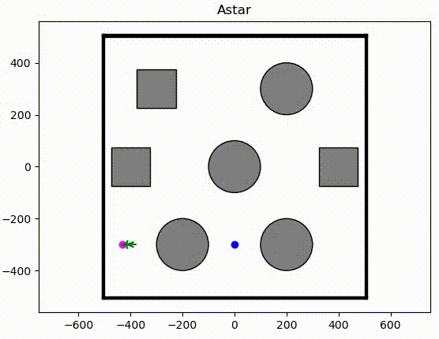
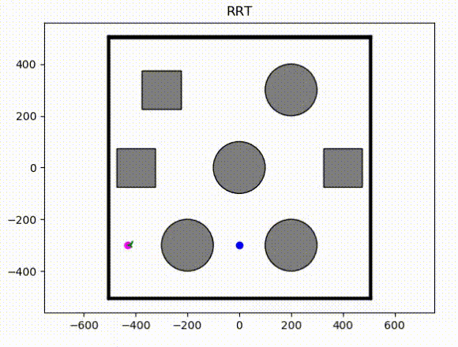

# Motion Planning Algorithms for Non Holonomic Robots using ROS and Turtlebot

## Overview
This repository implements different motion planning algorithms for non holonomic robots using ROS. All the algorithms are tested using turtlebot in Gazebo. 

## Non Holonomic Robot

In the previous project, holonomic robot behaviour was implemented wherein the robot could move sideways. The vehicles (cars, mobile robots etc) are modelled as non-holonomic robots where a neighbour coordinate along a trajectory given the position and orientation is expressed as - 

$$ dx = (radius/2.0)*(u_L+u_R)*\cos(\theta_{initial})*dt $$
<!-- $$ dx = (radius/2.0)*(u_L+u_R)*\sin(\theta_(initial))*dt $$
$$ \theta_(initial) += (radius/L)*(u_R-u_L)*dt $$ -->

## Project Structure

```
    .
    ├── Search Based            
    │   ├── A star       
    │   └── Dijkstra       
    |    
    ├── Curve Based            
    │   ├── Dubins Curve       
    │   └── Reed Shepp Curve       
    |
    └── Sampling Based
        ├── RRT       
        └── RRT*            

```

## Search Based Algorithm

<div align=left>
<table>
  <tr>
    <td></a></td>
  </tr>
</table>

</div>

## Sample Based Algorithm

<div align=left>
<table>
  <tr>
    <td></a></td>
  </tr>
</table>

</div>

## Contact

If you have any questions, please let me know:

- Shaswat Garg {[sis_shaswat@outlook.com]()}

