# Motion Planning Algorithms for Robots

## Overview
This repository implements different motion planning algorithms like Heuristic and Incremental Search based and Sampling based algorithms in a 2D environment for a point robot. All the algorithms are implemented in python. The environment is implemented using a priority queue and is made effecient using the concept of OOPs.

## Project Structure

```
    .
    ├── Search Based            
    │   ├── Heuristic Search                
    │   │   ├── A star       
    │   │   ├── Bidirectional A star       
    │   │   ├── Dijkstra       
    │   │   ├── BFS      
    │   │   └── Anytime Repairing A star      
    |   |
    │   └── Incremental Search                
    │       ├── D star       
    │       ├── Lifelong Planning A star       
    │       └── Anytime Repairing A star 
    │ 
    └── Sampling Based
        ├── Multi Query Search                
        │   ├── RRT       
        │   ├── Extend RRT       
        │   ├── Dynamic RRT       
        │   ├── RRT Connect    
        │   ├── FMT* 
        │   ├── RRT#
        │   ├── RRT*  
        │   ├── Informed RRT* 
        │   └── RRT* Smart      
        |
        └── Single Query Search                
            ├── PRM       
            └── LazyPRM       

```

## Heuristic Search Based Algorithm

<div align=left>
<table>
  <tr>
    <td></a></td>
    <td>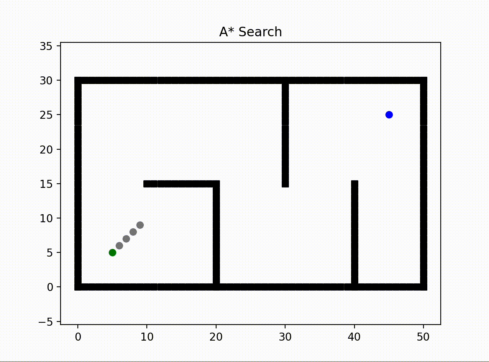</a></td>
  </tr>
</table>

<table>
  <tr>
    <td>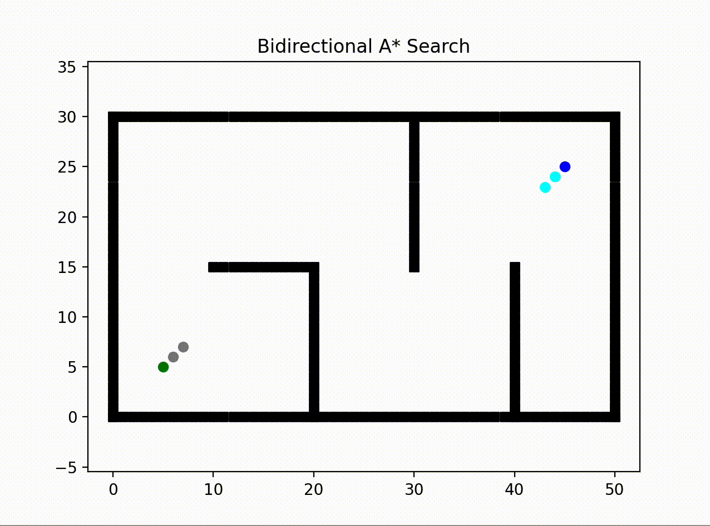</a></td>
    <td>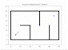</a></td>
  </tr>
</table>
</div>

## Incremental Search Based Algorithm

<div align=left>
<table>
  <tr>
    <td></a></td>
    <td>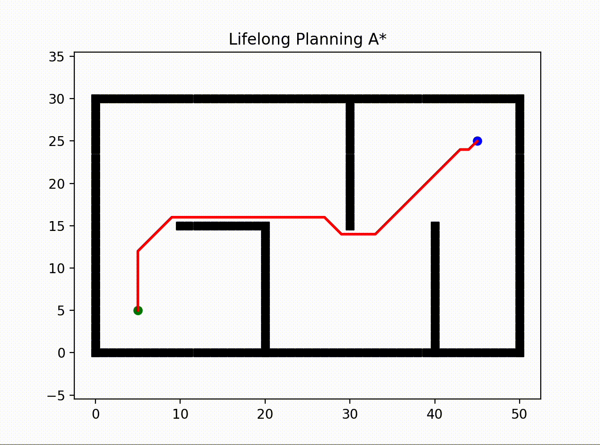</a></td>
  </tr>
</table>

<table>
  <tr>
    <td>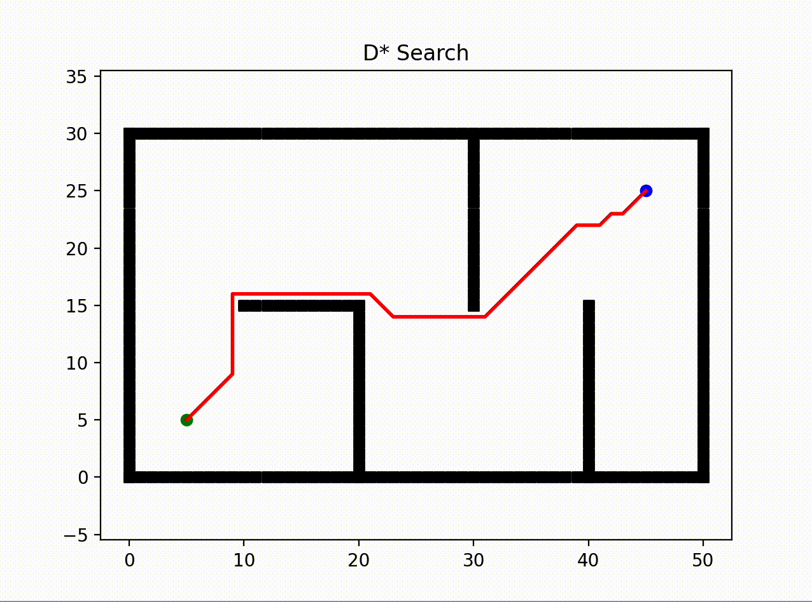</a></td>
  </tr>
</table>
</div>

## Multi Query Sample Based Algorithm

<div align=left>
<table>
  <tr>
    <td>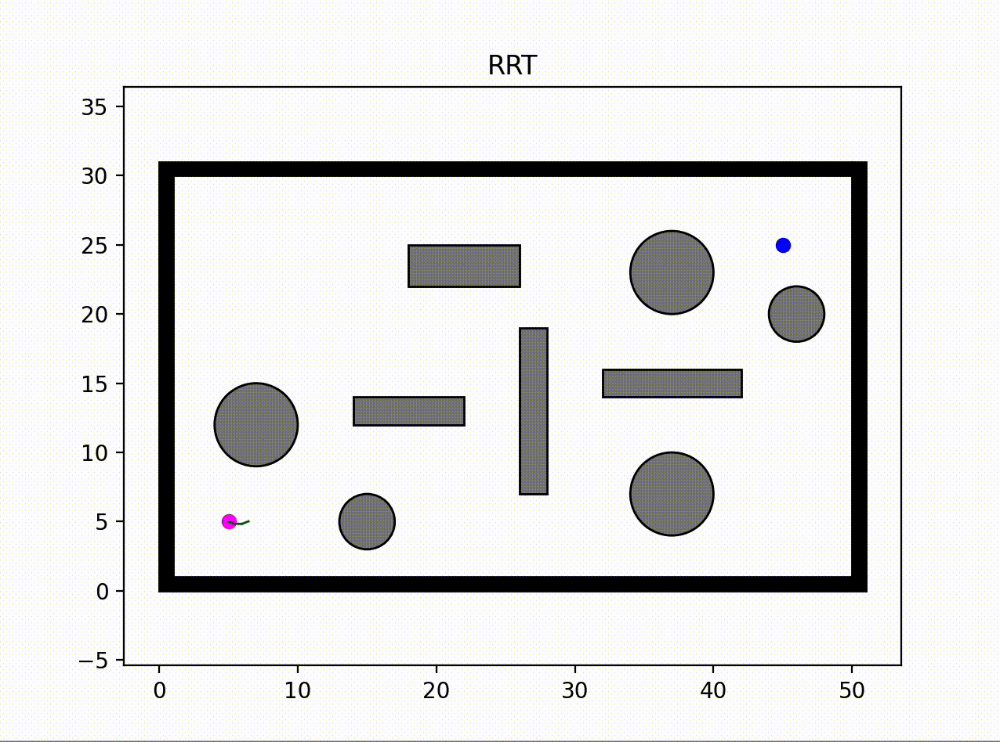</a></td>
    <td>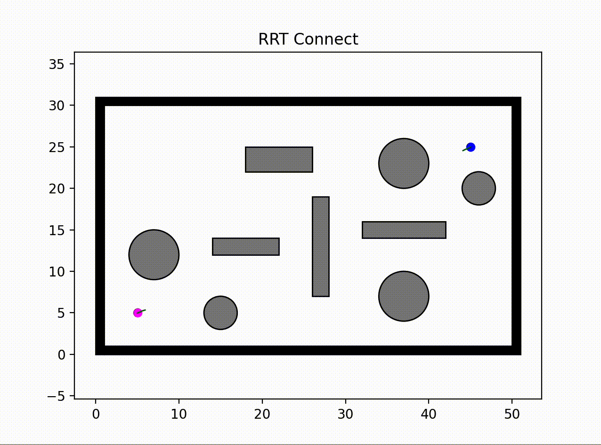</a></td>
  </tr>
</table>

<table>
  <tr>
    <td>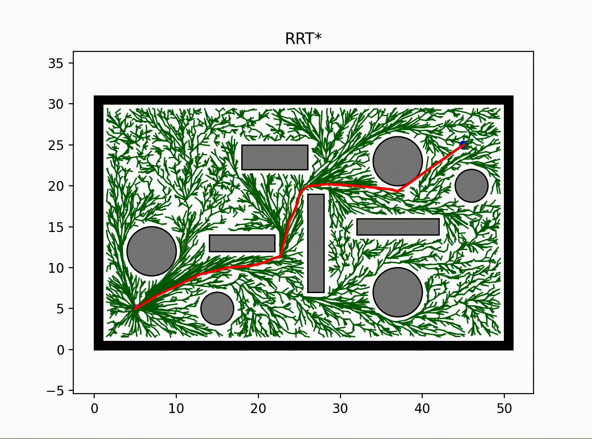</a></td>
    <td>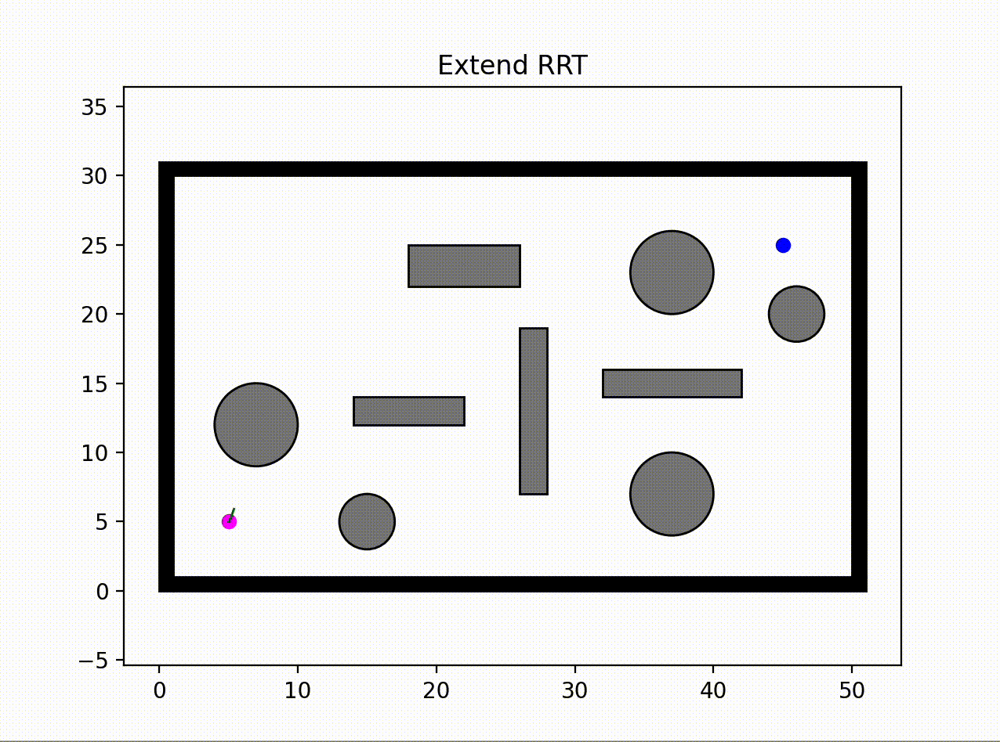</a></td>
  </tr>
</table>

<table>
  <tr>
    <td>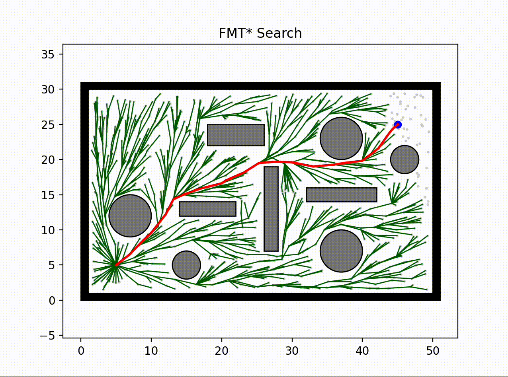</a></td>
    <td></a></td>
  </tr>
</table>
</div>

## Single Query Sample Based Algorithm

<div align=left>
<table>
  <tr>
    <td>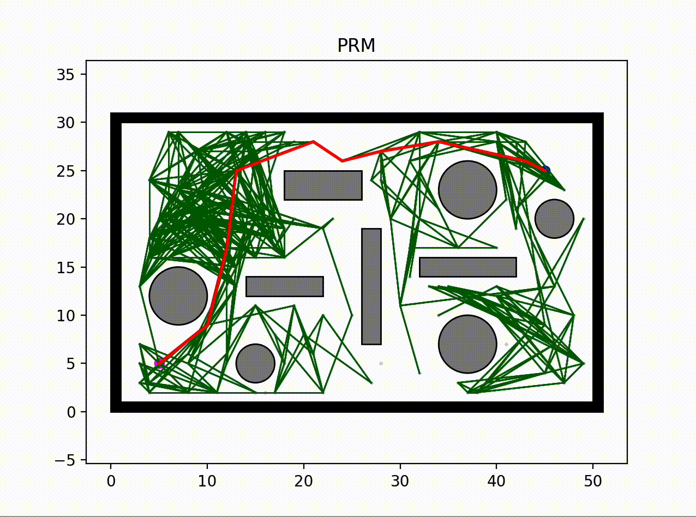</a></td>
    <td></a></td>
  </tr>
</table>
</div>

## Contact

If you have any questions, please let me know:

- Shaswat Garg {[sis_shaswat@outlook.com]()}

