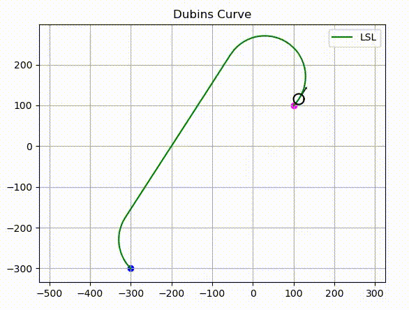

# Motion Planning Algorithms for Non Holonomic Robots using ROS and Turtlebot

## Overview
This repository implements different motion planning algorithms for non holonomic robots using ROS. All the algorithms are tested using turtlebot in Gazebo. 

## Non Holonomic Robot

In the previous project, holonomic robot behaviour was implemented wherein the robot could move sideways. Vehicles (cars, mobile robots etc) are modelled as non-holonomic robots where a neighbour coordinate along a trajectory given the position and orientation is expressed as - 

$$ \begin{align}
\begin{split}
  x_{pos} &= x_{pos} + \frac{radius \ast (u_L + u_R) \ast cos(\theta) \ast dt}{2}
\\
  y_{pos} &= y_{pos} + \frac{radius \ast (u_L + u_R) \ast sin(\theta) \ast dt}{2}
\\
  \theta_{initial} &= \theta_{initial} + \frac{radius \ast (u_R-u_L) \ast dt}{L}
\end{split}
\end{align} $$

Where $u_L$ and $u_R$ are the velocity of left and right wheel, $radius$ is the radius of the wheel, $L$ is the distance between the centre of two wheels.

## Project Structure

```
    .
    ├── Search Based            
    │   ├── A star       
    │   └── Dijkstra       
    |    
    ├── Curve Based            
    │   ├── Dubins Curve       
    │   └── Reed Shepp Curve       
    |
    └── Sampling Based
        ├── RRT       
        └── RRT*            

```

## A* Algorithm

<div align=left>
    <td></a></td>
</div>

## RRT

<div align=left>
    <td></a></td>
</div>

## Dubins Curve

<div align=left>
    <td></a></td>
</div>

## Contact

If you have any questions, please let me know:

- Shaswat Garg {[sis_shaswat@outlook.com]()}

