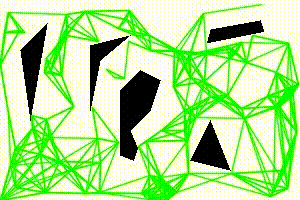

# Motion_planning_of_Robots

## Overview
This repository implements different motion planning algorithms like Heuristic and Incremental Search based and Sampling based algorithms in a 2D environment for a point robot. All the algorithms are implemented in python. The environment is implemented using a priority queue and is made effecient using the concept of OOPs.

## Project Structure

## Heuristic Search Based Algorithm

## Incremental Search Based Algorithm

## Contact

If you have any questions, please let me know:

- Shaswat Garg {[sis_shaswat@outlook.com]()}

